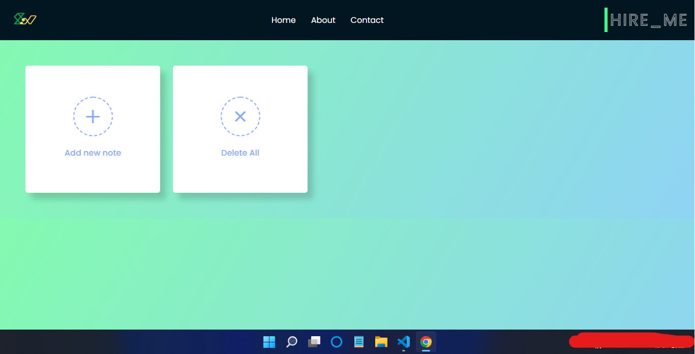

# Stock Note Application Using JavaScript
This is a notes application made using JavaScript which features Nice UI and animations. So make sure to try this out

## Creator

- [@cleverhare](https://www.github.com/cleverhare)


## Screenshots



## Run On your local Machine

Clone the Zip File or Download it
OR run the following
```bash
  git clone git@github.com:cleverhare/stock-note.git
```
Now find index.html file and Click to Run it.  (On your Favorite Browser)
    
## 🔗 Links
[](https://stock-note.netlify.app/)

[](https://www.linkedin.com/in/soumyajit-brahma-b665b4231/)

[](https://twitter.com/scaresteeler)

[](https://fiverr.com/cleverhare)


## Future Updates
- New Color Themes
- Alarm Feature
- And many More :)

## Tribute

Thanks For making it till the end! Your Support is always accepted. Thanks :)

## Live Link

https://stock-note.netlify.app/

